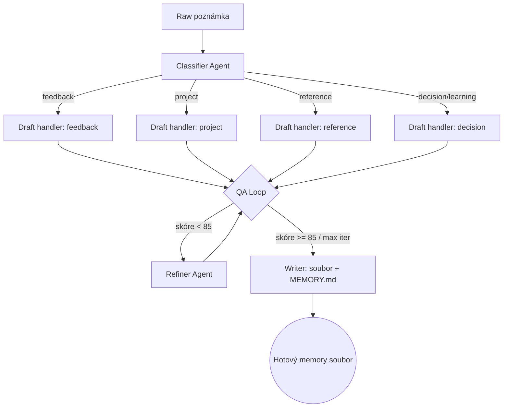
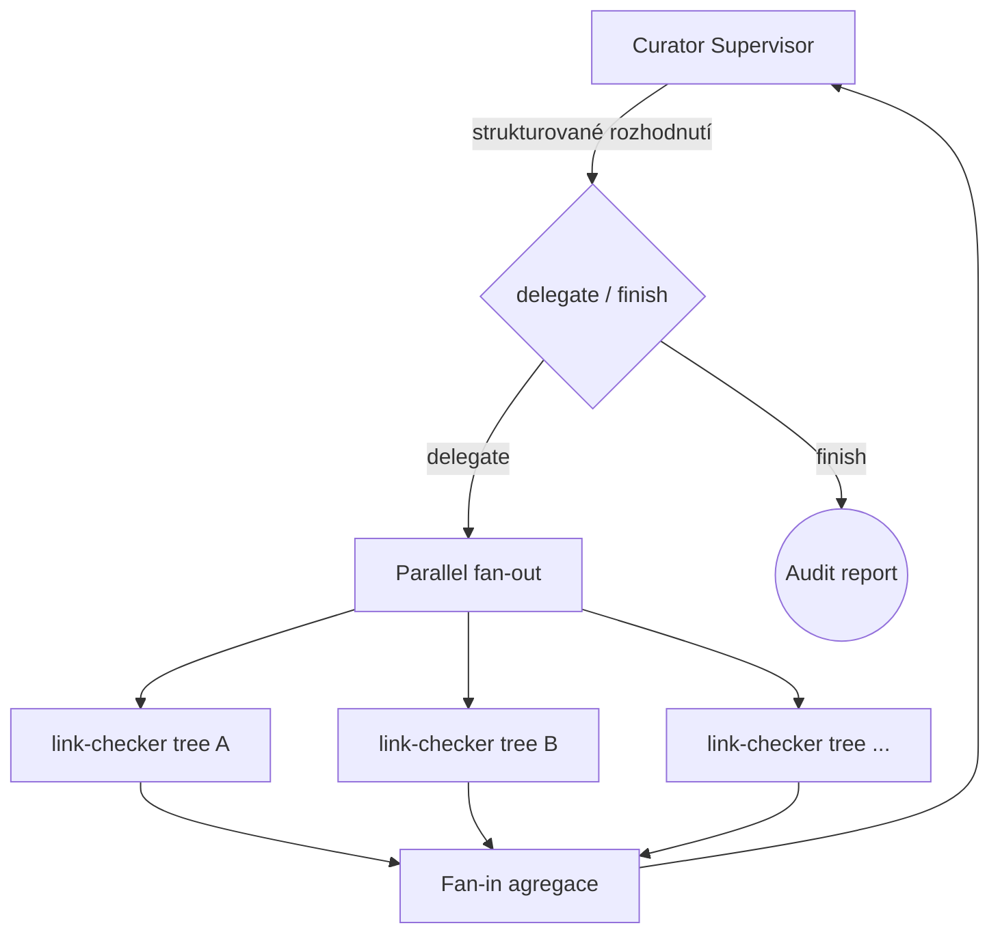

# Hub Curator — design dokument

> Domácí úkol: projekt s praktickým použitím SDK pro kódovací agenty,
> demonstrující orchestraci (workflow + multi-agent).

## 1. Co to je

**Hub Curator** je CLI nástroj postavený na **Claude Agent SDK (Python)**, který
automatizuje práci s markdown knowledge base — konkrétně s auto-memory systémem
typu „one fact = one file + frontmatter + `[[odkazy]]` + MEMORY.md index".

Má dva podpříkazy:

| Podpříkaz | Reálný úkol | Vstup | Výstup |
|---|---|---|---|
| `curate add "<poznámka>"` | Z raw brainstorm poznámky udělá hotový, validní memory soubor a zařadí ho do indexu | věta volným textem | nový `*.md` + řádek v `MEMORY.md` |
| `curate audit` | Najde hygienické problémy v celé KB — rozbité odkazy, prošlá data, chybějící indexové řádky, duplicity | cesta ke KB | audit report (markdown) |

## 2. Proč je to praktické

Není to demo — automatizuje skutečný, opakovaný workflow:

- **`add`** = zhmotnění věty z `CLAUDE.md`: *„Rychlý brainstorm → ty distilluješ →
  markdown"*. Ručně to znamená: rozhodnout typ, napsat frontmatter, vymyslet
  slug, dopsat řádek do indexu. Curator to udělá za jeden příkaz.
- **`audit`** = memory hygiena. Knowledge base degraduje — odkazy se rozbíjejí,
  fakta s datem („defer until Q3") zastarají, soubory se zapomenou zaindexovat.
  Ruční kontrola je nuda; agent ji projde za vteřiny.

Nástroj je generický — funguje na libovolné markdown KB se stejnou konvencí,
ne jen na jednom konkrétním Hubu.

## 3. Pokrytí zadání

| Požadavek zadání | Jak je splněn |
|---|---|
| SDK pro kódovacího agenta | Claude Agent SDK (Python), kódovací agent = Claude Code |
| Workflow — **Sequential** | `add`: klasifikuj → draft → zařaď (každý krok závisí na předchozím) |
| Workflow — **Parallel** | `audit`: fan-out — paralelní sken stromů KB přes `anyio.create_task_group()`, pak fan-in do agregátoru |
| Workflow — **Conditional** | `add`: klasifikátor rozhodne typ memory (`feedback`/`project`/`reference`/`decision`/`learning`) a routuje na odpovídající draft-handler |
| Workflow — **Loop** | `add`: draft → QA evaluator (skóre 0–100) → refiner → opakuj dokud skóre ≥ 85 nebo max 4 iterace |
| Multi-agent — **Supervisor** | `audit`: kurátor-supervisor deleguje strukturovaným rozhodnutím na specialisty a sám rozhodne, kdy skončit |
| Praktické použití | Automatizuje reálný memory workflow (viz §2) |

Jeden nástroj, ale úmyslně navržený tak, aby každý pattern padl na *malý*
přirozený podúkol — proto zůstává v rozsahu MVP (postavitelné za jeden den)
a zároveň demonstruje celou paletu orchestrace.

## 4. Architektura

```
                          curate <command>
                                │
              ┌─────────────────┴─────────────────┐
              │                                   │
        curate add                          curate audit
   (Conditional → Sequential → Loop)   (Supervisor + Parallel)
```

### 4.1 `curate add` — Conditional → Sequential → Loop



**Sequential** je rámec celého příkazu: `classify → draft → QA-loop → write`.
**Conditional** je krok `classify` — vybere se právě jeden draft-handler podle
typu. Každý typ má jiný template frontmatteru a jiné povinné sekce (např.
`feedback` vyžaduje `**Why:**` + `**How to apply:**`).
**Loop** je QA — evaluator kontroluje validní frontmatter, rozlišitelný slug,
existující cílové soubory u `[[odkazů]]`, dodržení template; refiner opravuje.

### 4.2 `curate audit` — Supervisor + Parallel



Supervisor řídí explicitní control loop (strukturovaný JSON output:
`delegate` / `finish`) a deleguje na tři specialisty:

| Specialista | Hledá |
|---|---|
| `link-checker` | `[[odkazy]]`, které neukazují na existující memory soubor |
| `staleness-detector` | fakta s prošlým datem / splněnou podmínkou („defer until…", absolutní data v minulosti) |
| `index-sync` | memory soubory bez řádku v `MEMORY.md` a naopak osiřelé řádky |

Uvnitř `link-checker` (a dle potřeby dalších) běží **Parallel** fan-out: každý
podstrom KB se skenuje souběžně, výsledky se slijí (fan-in) zpět k supervisorovi.

## 5. Struktura projektu

```
Vibe-Coding-HW3/
├── README.md               # rychlý start + mapa na zadání
├── DESIGN.md               # tento dokument
├── pyproject.toml          # deps: claude-agent-sdk, anyio
├── .env.example            # ANTHROPIC_API_KEY
├── src/hub_curator/
│   ├── __main__.py         # CLI: argparse → add | audit
│   ├── common.py           # run_agent() helper, model konstanty
│   ├── agents.py           # AgentDefinition specifikace všech agentů
│   ├── add_memory.py       # Conditional + Sequential + Loop
│   ├── audit.py            # Supervisor + Parallel
│   └── kb.py               # I/O nad KB: čtení stromů, frontmatter, index
└── sample_kb/              # přibalená demo KB (NDA-safe, reprodukovatelné)
    ├── MEMORY.md
    ├── feedbacks/…
    └── references/…        # úmyslně obsahuje 1 rozbitý odkaz + 1 stale fakt
```

## 6. Klíčová rozhodnutí

- **Demo proti `sample_kb/`, ne proti reálnému Hubu.** NDA-safe, reprodukovatelné
  pro hodnotitele. Reálná KB se připojí přes `--root <cesta>`.
- **Per-agent izolované session.** Každý agent (`query()` nebo `ClaudeSDKClient`)
  běží ve vlastním kontextu — dle vzoru kurzu, čisté hranice mezi rolemi.
- **Strukturovaný output u supervisora a klasifikátoru.** `output_format` s
  JSON schématem — rozhodnutí řídí kód, ne parsování textu.
- **`audit` je read-only.** Vrací report, nemění soubory. Aplikace patchů je
  mimo MVP rozsah (možné rozšíření).
- **Modely.** Specialisté a handlery na `sonnet`; supervisor/classifier rovněž
  `sonnet` (rozhodnutí jsou jednoduchá, ale chceme spolehlivý strukturovaný output).

## 7. Realizace

Projekt postaví agent **Hallux** (meta-agent / AI architekt) na základě tohoto
dokumentu. Akceptační kritérium: oba podpříkazy proběhnou proti `sample_kb/` a
README ukazuje očekávaný výstup.
