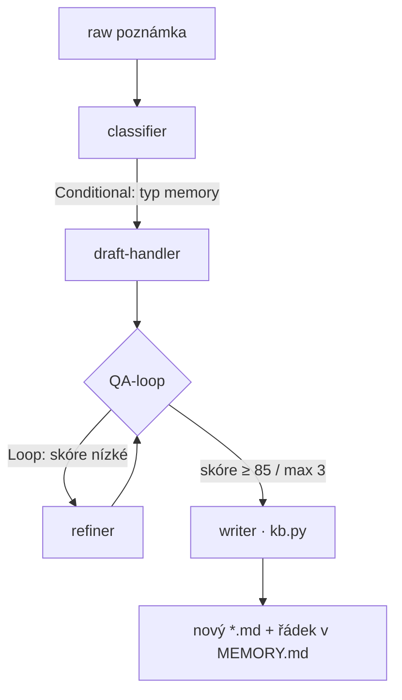
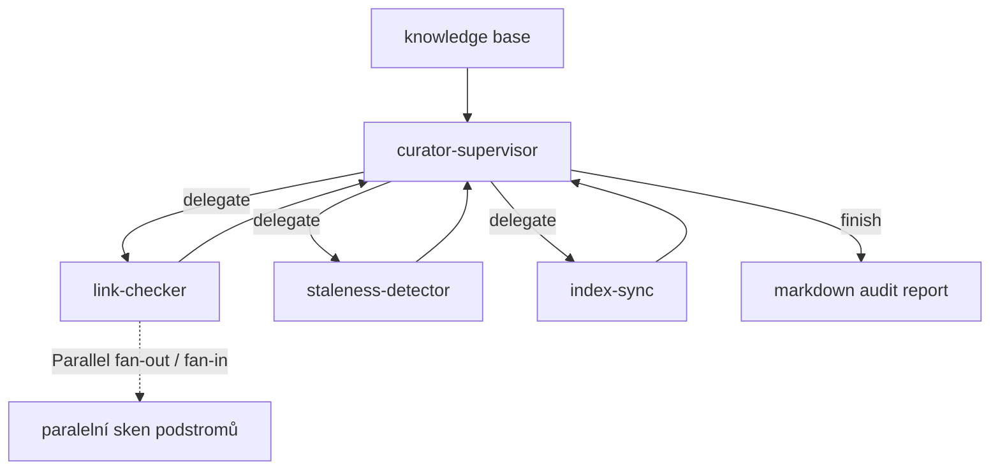

# Hub Curator

CLI nástroj postavený na **Claude Agent SDK (Python)**, který automatizuje
práci s markdown auto-memory knowledge base — systémem typu
„one fact = one file + frontmatter + `[[odkazy]]` + `MEMORY.md` index".

Domácí úkol kurzu: praktické použití SDK pro kódovacího agenta s ukázkou
orchestrace — projekt demonstruje **všech 5 patternů** (4 workflow +
multi-agent supervisor).

## Co to dělá

| Podpříkaz | Úkol | Výstup |
|---|---|---|
| `curate add "<poznámka>"` | Z raw brainstorm věty udělá hotový validní memory soubor a zařadí ho do indexu | nový `*.md` + řádek v `MEMORY.md` |
| `curate audit` | Najde hygienické problémy v celé KB — rozbité odkazy, prošlá data, chybějící indexové řádky | markdown audit report |

## Mapa na zadání — 5 patternů

| Pattern | Kde | Detail |
|---|---|---|
| **Sequential** | `add` | Rámec příkazu: classify → draft → QA-loop → write |
| **Conditional** | `add` | Classifier zvolí typ memory a routuje na jeden ze 4 draft-handlerů |
| **Loop** | `add` | QA-loop: draft → evaluator → refiner, dokud skóre ≥ 85 / max 3 iterace |
| **Parallel** | `audit` | Fan-out: paralelní sken podstromů KB přes `anyio.create_task_group()` |
| **Supervisor** | `audit` | Kurátor strukturovaným JSON deleguje na 3 specialisty a řídí control loop |

## Architektura

`curate add` — Conditional → Sequential → Loop:



`curate audit` — Supervisor + Parallel:



Veškerá **deterministika** (extrakce `[[odkazů]]`, parsování frontmatteru,
čtení indexu, zápis souborů) je v `kb.py` — čistý Python bez API. Agenti
dostávají jen kompaktní pre-digest, nikdy raw dumpy souborů. To je klíčové
pro tokenovou efektivitu.

## Struktura projektu

```
Vibe-Coding-HW3/
├── README.md  DESIGN.md  PLAN.md
├── pyproject.toml          # deps: claude-agent-sdk, anyio, python-dotenv
├── .env.example  .gitignore
├── src/hub_curator/
│   ├── __main__.py         # CLI: argparse → add | audit
│   ├── common.py           # run_agent() helper, konstanty modelů
│   ├── agents.py           # AgentDefinition všech agentů
│   ├── kb.py               # deterministická I/O vrstva nad KB
│   ├── add_memory.py       # Conditional + Sequential + Loop
│   └── audit.py            # Supervisor + Parallel
└── sample_kb/              # demo KB (NDA-safe) se 3 úmyslnými defekty
```

## Instalace

Vyžaduje Python 3.10+ a [uv](https://github.com/astral-sh/uv).

```bash
uv venv
uv sync
```

Pro živá API volání zkopíruj `.env.example` na `.env` a doplň
`ANTHROPIC_API_KEY`.

## Použití

```bash
# Audit přibalené ukázkové KB
curate audit

# Audit vlastní KB
curate audit --root /cesta/k/moji/kb

# Přidání memory záznamu — náhled bez zápisu
curate add "QA-loop má strop 3 iterace kvůli nákladům" --dry-run

# Přidání memory záznamu — reálný zápis
curate add "QA-loop má strop 3 iterace kvůli nákladům"
```

Bez instalace lze spustit i přímo z repozitáře:

```bash
python -m hub_curator audit
python -m hub_curator add "..." --dry-run
```

## Ukázková KB a úmyslné defekty

`sample_kb/` obsahuje 6 generických (NDA-safe) memory souborů a **3 záměrné
defekty**, na kterých `curate audit` demonstruje detekci:

| Defekt | Soubor | Problém |
|---|---|---|
| Rozbitý odkaz | `feedbacks/struktura-pred-implementaci.md` | odkazuje `[[stručné-prompty]]`, cílový soubor má slug `stexne-prompty` |
| Prošlé datum | `decisions/loop-stropy.md` | `defer_until: 2026-04-30` už uplynulo |
| Chybí v indexu | `learnings/paralelni-sken-zrychluje.md` | soubor existuje, ale není v `MEMORY.md` |

## Očekávaný výstup `curate audit`

```
HUB CURATOR — audit (Supervisor + Parallel)
Načteno: 6 memory souborů, 4 podstromů

Supervisor — iterace 1/6
  Supervisor deleguje na: link-checker
  Fan-out: paralelní sken podstromů KB
  [parallel] sken podstromu 'feedbacks' …
  [parallel] sken podstromu 'references' …
  ...
  Fan-in: celkem 1 rozbitých odkazů ze všech podstromů
Supervisor — iterace 2/6
  Supervisor deleguje na: staleness-detector
Supervisor — iterace 3/6
  Supervisor deleguje na: index-sync
Supervisor — iterace 4/6
  >>> Supervisor dokončil audit po 4 iteracích.

=== AUDIT REPORT ===
# Audit knowledge base

## Rozbité odkazy (1)
- feedbacks/struktura-pred-implementaci.md → [[stručné-prompty]]

## Zastaralá fakta (1)
- decisions/loop-stropy.md → defer_until 2026-04-30 (prošlé)

## Nesoulad indexu (1)
- learnings/paralelni-sken-zrychluje.md chybí v MEMORY.md
```

Report nahlásí všechny 3 defekty; v logu je vidět supervisor delegace
i paralelní fan-out.

## Tokenová efektivita

- Deterministiku dělá kód (`kb.py`), ne agent — agenti dostávají pre-digest.
- Levné modely jako default (`haiku`), `sonnet` jen pro tvorbu/opravu obsahu.
- Nízké stropy: QA-loop max 3 iterace, supervisor max 6.
- Stručné system prompty (2–4 věty).
